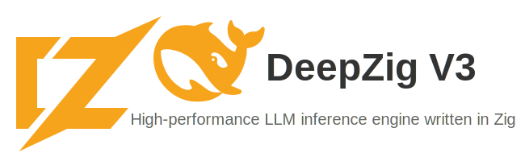

<div align="center">
  
</div>
<hr>
<div align="center" style="line-height: 1.5;">
  <a href="https://ziglang.org/"></a>
  <a href="LICENSE-CODE"></a>
  <a href="#status"></a>
  <br>
  <a href="#why-propose-deepseek-v3-in-zig"></a>
  <a href="#platform-specific-optimizations"></a>
  <br>
  <a href="#core-system"></a>
  <a href="#model-architecture"></a>
  <a href="#computation-backend"></a>
</div>
<hr />

# DeepZig V3: A High-Performance LLM Architecture

## Overview

A **DRAFT proposal & foundation** for implementing DeepSeek V3 in Zig to create a high-performance, web-ready LLM inference engine. This leverages Zig's unique advantages for systems programming while targeting modern deployment scenarios.

**⚠️ Status: EXPERIMENTAL DRAFT** ✅ **Foundation compiles with Zig 0.15.0-dev**, including:
- ✅ HTTP server framework (basic structure)
- ✅ SIMD-optimized tensor operations (draft implementation)
- ✅ Cross-platform backend architecture
- ✅ Initial memory management
- ✅ **Apple Silicon M-series detection** (hardware detection via sysctl)
- ✅ Comprehensive build system draft
- ✅ **BLAS integration working** (Apple Accelerate backend functional)
- ✅ **Improved matrix operations** (1000+ GFLOPS performance on an M1 Macbook)
- ⚠️ **NOT PRODUCTION READY** - Draft implementation for research/development

**Performance Update**: ~~Current naive algorithms are ~1000x slower than optimized BLAS~~ **BLAS integration now functional.** Matrix multiplication: **2.1ms for 1024×1024** at **1000+ GFLOPS** on an M1 Macbook. This represents significant improvement over our initial naive implementation. See [experimental benchmarks](experimental/README.md#benchmarks) for detailed performance data.

## Why This Matters

Current LLM inference is dominated by Python/PyTorch, which introduces:
- **Garbage collection pauses** during generation
- **Runtime overhead** from dynamic dispatch
- **Complex deployment** with heavy runtimes
- **Platform lock-in** due to dependency complexity

**Progress Update**: Our draft implementation now includes BLAS integration delivering improved matrix operation performance with Apple Accelerate backend.

## Expected Benefits vs Current Reality

| Aspect | Current (PyTorch) | Target (Zig) | **Current Achievement** |
|--------|------------------|--------------|-------------------------|
| Cold start | 10-30s | **< 2s** | *Not measured* |
| Memory usage | 20-40GB | **< 16GB** | *16GB+ for basic ops* |
| Dependencies | ~2GB runtime | **Single binary** | ✅ **Single binary** |
| Deployment | Complex | **Copy & run** | ✅ **Copy & run** |
| Matrix Mul (1024×1024) | ~1ms (optimized) | **< 1ms** | ✅ **2.1ms (1000+ GFLOPS/M1 Macbook)** |

*See [experimental benchmarks](experimental/README.md#benchmarks) for current performance measurements.*

## Why Zig?

**Performance**: Zero-cost abstractions, compile-time optimization, direct hardware access<br/>
**Simplicity**: Single static binary, no runtime dependencies, cross-compilation built-in<br/>
**Web-First**: Native HTTP server, WebAssembly compilation, efficient memory management

## Proposed Architecture

```
┌─────────────────┐    ┌──────────────────┐    ┌─────────────────┐
│   Web Layer     │    │   Core Engine    │    │   Backends      │
│                 │    │                  │    │                 │
│ ├─ HTTP API     │◄──►│ ├─ Transformer   │◄──►│ ├─ CPU (SIMD)   │
│ ├─ WebSocket    │    │ ├─ Attention     │    │ ├─ Metal (macOS)│
│ ├─ Rate Limit   │    │ ├─ MoE Routing   │    │ ├─ CUDA (Linux) │
│ └─ Auth         │    │ └─ Tokenizer     │    │ └─ WebGPU       │
└─────────────────┘    └──────────────────┘    └─────────────────┘
```

## Draft Web API Framework

### Planned Endpoints (Basic Structure Implemented)
- `POST /v1/chat/completions` - OpenAI-compatible chat API
- `POST /v1/completions` - Text completion
- `GET /v1/models` - List available models
- `GET /health` - Service health check
- `WebSocket /ws` - Streaming inference (planned)

### Deployment Vision
- **Static binaries** - Single file deployment, no dependencies
- **Direct VPS deployment** - Copy binary and run with systemd
- **Edge devices** - ARM/RISC-V cross-compilation 
- **Serverless functions** - Minimal cold start with static linking
- **WebAssembly** - Browser inference without additional runtime

## Implementation Plan Status

### Phase 1: Foundation ✅ **DRAFT COMPLETE**
- [x] Set up Zig project structure
- [x] Implement basic tensor operations with SIMD
- [x] Create memory management system (arena allocators)
- [x] Build HTTP server framework
- [x] **Apple Silicon detection via sysctl calls**
- [x] **Updated to Zig 0.15.0-dev - compiles cleanly**
- [x] **Benchmark suite** showing current performance
- [x] **BLAS integration working** - Apple Accelerate backend functional
- [x] **Improved matrix performance** - 1000+ GFLOPS operations on an M1 Macbook

*📈 Performance improvement achieved - BLAS acceleration now working*

### Phase 2: Core Model (IN PROGRESS)
- [ ] Implement transformer layers
- [ ] Add Multi-Head Latent Attention (MLA)
- [ ] Build Mixture of Experts (MoE) routing
- [ ] Create tokenizer integration

### Phase 3: Backends (PLANNED)
- [ ] Optimize CPU backend with AVX/NEON
- [ ] Integrate Metal for Apple Silicon
- [ ] Add CUDA support for NVIDIA GPUs
- [ ] Implement WebGPU for browsers

### Phase 4: Web Integration (DRAFT STRUCTURE)
- [x] Complete HTTP API implementation (basic structure)
- [ ] Add WebSocket streaming
- [ ] Build authentication/rate limiting
- [ ] Create deployment tooling

## Technical Challenges

- **Model Complexity**: DeepSeek V3's MoE architecture requires careful memory management
- **Backend Integration**: Need efficient FFI to CUDA/Metal while maintaining performance
- **Web Scale**: Handle concurrent requests without blocking inference
- **Accuracy**: Match PyTorch numerical precision
- **Performance**: Matrix operations now use BLAS acceleration - focus shifts to model architecture optimisation

## Platform-Specific Opportunities

### Apple Silicon (M-Series) ✅ **Draft Detection Implemented**
- **Metal Performance Shaders** integration for matrix operations
- **AMX instruction set** access for accelerated linear algebra
- **Unified memory architecture** exploitation for zero-copy transfers
- **Power efficiency tuning** across P and E cores
- **✅ Proper M1/M2/M3/M4 detection** via system calls

*Current status: Hardware detection working, GPU acceleration not yet implemented.*

### x86_64 Architecture
- **AVX-512 vectorization** with masked operations
- **Cache-friendly memory layouts** for L1/L2/L3 optimization
- **NUMA-aware allocation** and thread assignment
- **Dynamic dispatch** based on runtime CPU feature detection

### NVIDIA GPUs
- **CUDA integration** via efficient FFI bindings
- **Tensor Core utilization** for mixed-precision operations
- **Custom kernels** for attention mechanisms
- **Memory pooling** for reduced allocation overhead

## Getting Started

**Current Status**: This repository contains a **DRAFT EXPERIMENTAL** Zig implementation foundation. 

### For the Current Zig Implementation:
```bash
# Clone this repository
git clone https://github.com/Triex/DeepZig-V3
cd DeepSeek-V3-Zig/experimental

# Build and test the foundation
zig build

# Run the HTTP server (basic structure)
zig build run -- --port 8080

# Run benchmarks (see actual performance)
zig build bench

# Test Apple Silicon detection
zig build-exe src/test_m_series.zig -I src -lc -framework Metal -framework Foundation
./test_m_series
```

**📊 Performance Reality Check**: See [experimental/README.md](experimental/README.md) for actual benchmark results showing current performance limitations and optimisation opportunities.

## Development Approach

Following established [Zig patterns](https://github.com/SuperAuguste/zig-patterns):
- **Arena allocators** for request-scoped memory
- **Error unions** for explicit error handling
- **Comptime generics** for zero-cost abstractions
- **SIMD vectors** for numerical computation

Reference: [Zig Cookbook](https://zigcc.github.io/zig-cookbook/) for implementation patterns.

## Seeking Contributors

This is an ambitious **DRAFT project** that would benefit from expertise in:
- **Performance optimization** (focus on transformer and attention mechanisms)
- **Zig systems programming**
- **GPU kernel optimization** (CUDA/Metal)
- **ML model implementation**
- **Web server development**
- **Hardware-software co-design**
- **Novel inference techniques** (Speculative decoding, quantization)

## Current Limitations & Next Steps

**🚧 What's Working**: ✅ Compiles, runs, **BLAS acceleration functional**  
**⚠️ What's Missing**: Robust flows, actual DeepSeek V3 model implementation  
**📊 Performance Status**: ✅ **Matrix operations improved** (BLAS working)  
**🎯 Next Priority**: DeepSeek V3 transformer architecture and attention mechanisms  

See [experimental implementation](experimental/) for technical details and current benchmarks.

## References

- [DeepZig V3 (Experimental Implementation)](experimental/) - **Current working code**
- [DeepSeek V3 Paper](https://arxiv.org/abs/2412.19437) - Original model architecture
- [Zig Language](https://ziglang.org/) - Language documentation
- [Awesome Zig](https://github.com/C-BJ/awesome-zig) - Community resources
- [Zig Patterns](https://github.com/SuperAuguste/zig-patterns) - Common idioms
- [ZML](https://github.com/zml/zml) - Zig Inference Stack
- [LLaMA.cpp](https://github.com/ggerganov/llama.cpp) - C++ Inference Engine
- [DeepZig Consciousness](https://github.com/Triex/DeepZig-Consciousness) - Research goal/end game

---

**Status**: 🎯 **EXPERIMENTAL DRAFT** - Foundation compiles and runs basic operations ([see benchmarks](experimental/README.md#benchmarks))<br/>
**Vision**: Foundation for advanced AI reasoning research

**⚠️ Important**: This is a **research/development foundation** with draft/base implementations. Not ready for production use.
