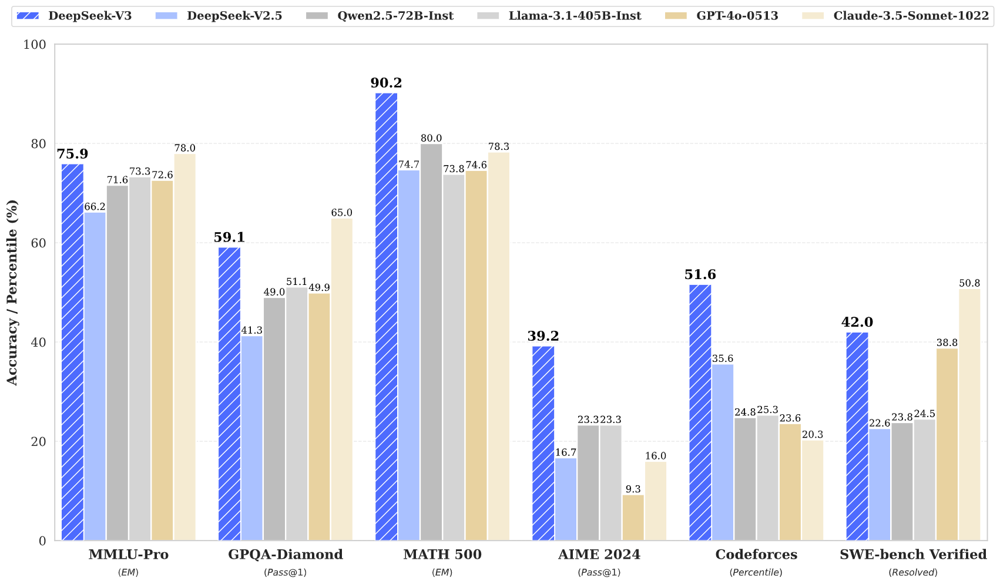

# DeepSeek-V3

<div align="center">
  
</div>

---

<div align="center" style="line-height: 1.5;">
  <a href="https://www.deepseek.com/"></a>
  <a href="https://chat.deepseek.com/"></a>
  <a href="https://huggingface.co/deepseek-ai"></a>
  <br>
  <a href="https://discord.gg/Tc7c45Zzu5"></a>
  <a href="https://github.com/deepseek-ai/DeepSeek-V2/blob/main/figures/qr.jpeg?raw=true"></a>
  <a href="https://twitter.com/deepseek_ai"></a>
  <br>
  <a href="https://github.com/deepseek-ai/DeepSeek-V3/blob/main/LICENSE-CODE"></a>
  <a href="https://github.com/deepseek-ai/DeepSeek-V3/blob/main/LICENSE-MODEL"></a>
  <br>
  <a href="https://arxiv.org/pdf/2412.19437"><b>📄 Read the Paper</b></a>
</div>

## Table of Contents

1. [Introduction](#1-introduction)
2. [Model Overview](#2-model-overview)
3. [Model Downloads](#3-model-downloads)
4. [Performance Benchmarks](#4-performance-benchmarks)
5. [Chat & API Access](#5-chat--api-access)
6. [Running Locally](#6-running-locally)
7. [Licensing](#7-licensing)
8. [Citation](#8-citation)
9. [Contact Us](#9-contact-us)

## 1. Introduction

**DeepSeek-V3** is a state-of-the-art Mixture-of-Experts (MoE) language model with **671 billion total parameters**, activating **37 billion parameters per token**. Building on the efficient architecture of DeepSeek-V2, it introduces cutting-edge innovations, including **Multi-head Latent Attention (MLA)**, **DeepSeekMoE**, an **auxiliary-loss-free load balancing strategy**, and a **Multi-Token Prediction (MTP)** training objective. These advancements deliver exceptional performance and scalability.

Pre-trained on **14.8 trillion high-quality, diverse tokens**, followed by Supervised Fine-Tuning (SFT) and Reinforcement Learning (RL), DeepSeek-V3 achieves **top-tier performance**, surpassing other open-source models and rivaling leading closed-source models. Remarkably, its full training required only **2.788 million H800 GPU hours**, with a stable process free of loss spikes or rollbacks.

<div align="center">
  
  <p><em>Benchmark performance showcasing DeepSeek-V3’s capabilities.</em></p>
</div>

## 2. Model Overview

### Architecture: Optimized for Efficiency
- **Innovative Load Balancing**: An auxiliary-loss-free strategy minimizes performance degradation while optimizing resource allocation.
- **Multi-Token Prediction (MTP)**: Enhances model performance and supports speculative decoding for faster inference.
- **DeepSeekMoE & MLA**: Leverages the proven efficiency of DeepSeek-V2’s architecture for large-scale MoE models.

### Pre-Training: Unprecedented Efficiency
- **FP8 Mixed Precision**: Validates FP8 training for large-scale models, reducing memory and computational overhead.
- **Optimized Communication**: Overcomes cross-node MoE training bottlenecks, achieving near-complete computation-communication overlap.
- **Cost-Effective Scaling**: Pre-trained on 14.8T tokens using only **2.664M H800 GPU hours**, with post-training requiring just **0.1M GPU hours**.

### Post-Training: Advanced Reasoning
- **Knowledge Distillation**: Integrates reasoning capabilities from DeepSeek-R1’s long-Chain-of-Thought (CoT) model, enhancing DeepSeek-V3’s reasoning while maintaining control over output style and length.

## 3. 🚀 Model Downloads

Access DeepSeek-V3 models, pre-trained and fine-tuned for exceptional performance:

<div align="center">

| Model Name | Total Parameters | Activated Parameters | Context Length | Download |
|------------|------------------|----------------------|----------------|----------|
| DeepSeek-V3-Base | 671B | 37B | 128K | [🤗 Hugging Face](https://huggingface.co/deepseek-ai/DeepSeek-V3-Base) |
| DeepSeek-V3 | 671B | 37B | 128K | [🤗 Hugging Face](https://huggingface.co/deepseek-ai/DeepSeek-V3) |

</div>

> **Note**: The total model size is **685B**, including **671B main model weights** and **14B Multi-Token Prediction (MTP) module weights**.

For detailed instructions on running the model locally, see [Section 6: Running Locally](#6-running-locally). Developers can explore [README_WEIGHTS.md](./README_WEIGHTS.md) for insights into model weights and MTP modules. Community contributions to MTP support are welcome!

## 4. Performance Benchmarks

### Base Model: Standard Benchmarks

DeepSeek-V3 excels across a wide range of tasks, particularly in **math** and **code**:

<div align="center">

| Category | Benchmark (Metric) | # Shots | DeepSeek-V2 | Qwen2.5 72B | LLaMA3.1 405B | DeepSeek-V3 |
|----------|-------------------|---------|-------------|-------------|---------------|-------------|
| **Architecture** | - | - | MoE | Dense | Dense | **MoE** |
| **Activated Params** | - | - | 21B | 72B | 405B | **37B** |
| **Total Params** | - | - | 236B | 72B | 405B | **671B** |
| **English** | Pile-test (BPB) | - | 0.606 | 0.638 | **0.542** | 0.548 |
| | BBH (EM) | 3-shot | 78.8 | 79.8 | 82.9 | **87.5** |
| | MMLU (Acc.) | 5-shot | 78.4 | 85.0 | 84.4 | **87.1** |
| | MMLU-Pro (Acc.) | 5-shot | 51.4 | 58.3 | 52.8 | **64.4** |
| | DROP (F1) | 3-shot | 80.4 | 80.6 | 86.0 | **89.0** |
| **Code** | HumanEval (Pass@1) | 0-shot | 43.3 | 53.0 | 54.9 | **65.2** |
| | MBPP (Pass@1) | 3-shot | 65.0 | 72.6 | 68.4 | **75.4** |
| | LiveCodeBench-Base (Pass@1) | 3-shot | 11.6 | 12.9 | 15.5 | **19.4** |
| **Math** | GSM8K (EM) | 8-shot | 81.6 | 88.3 | 83.5 | **89.3** |
| | MATH (EM) | 4-shot | 43.4 | 54.4 | 49.0 | **61.6** |
| | MGSM (EM) | 8-shot | 63.6 | 76.2 | 69.9 | **79.8** |
| **Chinese** | C-Eval (Acc.) | 5-shot | 81.4 | 89.2 | 72.5 | **90.1** |
| | CMMLU (Acc.) | 5-shot | 84.0 | **89.5** | 73.7 | 88.8 |
| **Multilingual** | MMMLU-non-English (Acc.) | 5-shot | 64.0 | 74.8 | 73.8 | **79.4** |

</div>

> **Note**: Bold indicates the best results. Scores within 0.3 points are considered equivalent. For detailed results, refer to the [technical paper](https://arxiv.org/pdf/2412.19437).

### Context Window
DeepSeek-V3 supports a **128K context window**, performing robustly in **Needle In A Haystack (NIAH)** tests across all lengths.

<div align="center">
  
  <p><em>DeepSeek-V3’s performance across context window lengths.</em></p>
</div>

### Chat Model: Competitive with Frontier Models

DeepSeek-V3’s chat model rivals leading closed-source models:

<div align="center">

| Benchmark (Metric) | DeepSeek-V2.5 | Qwen2.5 72B | LLaMA3.1 405B | Claude-3.5 | GPT-4o | DeepSeek-V3 |
|--------------------|---------------|-------------|---------------|------------|--------|-------------|
| MMLU (EM) | 80.6 | 85.3 | **88.6** | **88.3** | 87.2 | **88.5** |
| MMLU-Pro (EM) | 66.2 | 71.6 | 73.3 | **78.0** | 72.6 | 75.9 |
| DROP (3-shot F1) | 87.8 | 76.7 | 88.7 | 88.3 | 83.7 | **91.6** |
| HumanEval-Mul (Pass@1) | 77.4 | 77.3 | 77.2 | 81.7 | 80.5 | **82.6** |
| MATH-500 (EM) | 74.7 | 80.0 | 73.8 | 78.3 | 74.6 | **90.2** |
| AIME 2024 (Pass@1) | 16.7 | 23.3 | 23.3 | 16.0 | 9.3 | **39.2** |

</div>

### Open-Ended Generation

DeepSeek-V3 excels in conversational tasks, outperforming other open-source models:

<div align="center">

| Model | Arena-Hard | AlpacaEval 2.0 |
|-------|------------|----------------|
| DeepSeek-V2.5 | 76.2 | 50.5 |
| Qwen2.5-72B | 81.2 | 49.1 |
| LLaMA3.1-405B | 69.3 | 40.5 |
| GPT-4o | 80.4 | 51.1 |
| Claude-Sonnet-3.5 | 85.2 | 52.0 |
| **DeepSeek-V3** | **85.5** | **70.0** |

</div>

> **Note**: AlpacaEval 2.0 uses length-controlled win rate.

## 5. Chat & API Access

- **Chat with DeepSeek-V3**: Try it on our official platform: [chat.deepseek.com](https://chat.deepseek.com/sign_in).
- **API Access**: Integrate DeepSeek-V3 via our OpenAI-compatible API: [platform.deepseek.com](https://platform.deepseek.com/).

## 6. Running Locally

DeepSeek-V3 can be deployed locally using a variety of frameworks and hardware configurations. Below are the supported options:

### Supported Frameworks
1. **DeepSeek-Infer Demo**: Lightweight demo for FP8 and BF16 inference.
2. **SGLang**: Supports FP8/BF16 with MLA optimizations and multi-node tensor parallelism. MTP support is in progress ([details](https://github.com/sgl-project/sglang/issues/2591)).
3. **LMDeploy**: Efficient FP8/BF16 inference for local and cloud deployment ([instructions](https://github.com/InternLM/lmdeploy/issues/2960)).
4. **TensorRT-LLM**: Supports BF16 and INT4/8 quantization; FP8 support coming soon ([custom branch](https://github.com/NVIDIA/TensorRT-LLM/tree/main/examples/deepseek_v3)).
5. **vLLM**: Supports FP8/BF16 with pipeline parallelism ([instructions](https://docs.vllm.ai/en/latest/serving/distributed_serving.html)).
6. **LightLLM**: Single- and multi-node deployment for FP8/BF16 ([instructions](https://lightllm-en.readthedocs.io/en/latest/getting_started/quickstart.html)).
7. **AMD GPU**: Full FP8/BF16 support via SGLang.
8. **Huawei Ascend NPU**: BF16 support via MindIE ([instructions](https://modelers.cn/models/MindIE/deepseekv3)).

### Converting FP8 to BF16
DeepSeek-V3 uses FP8 weights by default. To convert to BF16:

```shell
cd inference
python fp8_cast_bf16.py --input-fp8-hf-path /path/to/fp8_weights --output-bf16-hf-path /path/to/bf16_weights
```

### Example: DeepSeek-Infer Demo

#### System Requirements
- **OS**: Linux with Python 3.10 (Mac/Windows not supported).
- **Dependencies**:
  ```pip-requirements
  torch==2.4.1
  triton==3.0.0
  transformers==4.46.3
  safetensors==0.4.5
  ```

#### Setup
1. Clone the repository:
   ```shell
   git clone https://github.com/deepseek-ai/DeepSeek-V3.git
   cd DeepSeek-V3/inference
   pip install -r requirements.txt
   ```
2. Download model weights from [Hugging Face](https://huggingface.co/deepseek-ai/DeepSeek-V3) and place them in `/path/to/DeepSeek-V3`.
3. Convert weights:
   ```shell
   python convert.py --hf-ckpt-path /path/to/DeepSeek-V3 --save-path /path/to/DeepSeek-V3-Demo --n-experts 256 --model-parallel 16
   ```
4. Run interactive chat:
   ```shell
   torchrun --nnodes 2 --nproc-per-node 8 --node-rank $RANK --master-addr $ADDR generate.py --ckpt-path /path/to/DeepSeek-V3-Demo --config configs/config_671B.json --interactive --temperature 0.7 --max-new-tokens 200
   ```

> **Note**: Hugging Face Transformers support is under development.

## 7. Licensing

- **Code**: Licensed under the [MIT License](LICENSE-CODE).
- **Model**: Governed by the [DeepSeek Model License](LICENSE-MODEL), supporting commercial use.

## 8. Citation

```bibtex
@misc{deepseekai2024deepseekv3technicalreport,
  title={DeepSeek-V3 Technical Report},
  author={DeepSeek-AI},
  year={2024},
  eprint={2412.19437},
  archivePrefix={arXiv},
  primaryClass={cs.CL},
  url={https://arxiv.org/abs/2412.19437},
}
```

## 9. Contact Us

For questions, feedback, or support, please:
- Raise an issue on [GitHub](https://github.com/deepseek-ai/DeepSeek-V3).
- Email us at [service@deepseek.com](mailto:service@deepseek.com).
