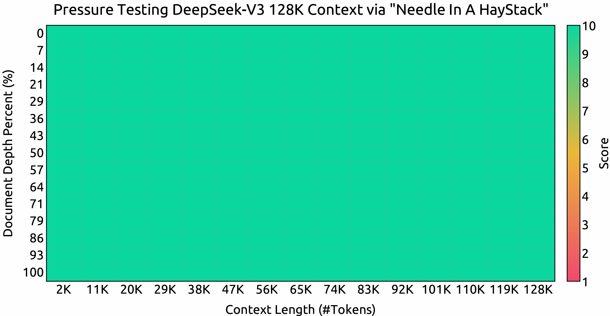

<!-- markdownlint-disable first-line-h1 -->
<!-- markdownlint-disable html -->
<!-- markdownlint-disable no-duplicate-header -->

<div align="center">
  
</div>
<hr>
<div align="center" style="line-height: 1;">
  <a href="https://www.deepseek.com/" target="_blank" style="margin: 2px;">
    
  </a>
  <a href="https://chat.deepseek.com/" target="_blank" style="margin: 2px;">
    
  </a>
  <a href="https://huggingface.co/deepseek-ai" target="_blank" style="margin: 2px;">
    
  </a>
</div>

<div align="center" style="line-height: 1;">
  <a href="https://discord.gg/Tc7c45Zzu5" target="_blank" style="margin: 2px;">
    
  </a>
  <a href="https://github.com/deepseek-ai/DeepSeek-V2/blob/main/figures/qr.jpeg?raw=true" target="_blank" style="margin: 2px;">
    
  </a>
  <a href="https://twitter.com/deepseek_ai" target="_blank" style="margin: 2px;">
    
  </a>
</div>

<div align="center" style="line-height: 1;">
  <a href="https://github.com/deepseek-ai/DeepSeek-V3/blob/main/LICENSE-CODE" style="margin: 2px;">
    
  </a>
  <a href="https://github.com/deepseek-ai/DeepSeek-V3/blob/main/LICENSE-MODEL" style="margin: 2px;">
    
  </a>
</div>


<p align="center">
  <a href="DeepSeek_V3.pdf"><b>Makale Bağlantısı</b>👁️</a>
</p>

## İçindekiler

1. [Giriş](#1-giriş)  
2. [Model Özeti](#2-model-özeti)  
3. [Model İndirmeleri](#3-model-indirmeleri)  
4. [Değerlendirme Sonuçları](#4-değerlendirme-sonuçları)  
5. [Sohbet Web Sitesi ve API Platformu](#5-sohbet-web-sitesi-ve-api-platformu)  
6. [Yerel Olarak Nasıl Çalıştırılır](#6-yerel-olarak-nasıl-çalıştırılır)  
7. [Lisans](#7-lisans)  
8. [Atıf](#8-atıf)  
9. [İletişim](#9-iletişim)  


## 1. Giriş

DeepSeek-V3'ü sunuyoruz: 671 milyar toplam parametreye sahip güçlü bir Mixture-of-Experts (MoE) dil modeli ve her bir token için 37 milyar parametre etkinleştiriliyor.  
Verimli çıkarım ve maliyet açısından etkili bir eğitim sağlamak amacıyla DeepSeek-V3, Multi-head Latent Attention (MLA) ve DeepSeekMoE mimarilerini benimser; bu yaklaşımlar DeepSeek-V2'de kapsamlı şekilde doğrulanmıştır.  
Bunun yanı sıra, DeepSeek-V3, yük dengeleme için yardımcı kayıpsız (auxiliary-loss-free) bir strateji geliştirerek öncülük eder ve daha güçlü performans için çoklu token tahminine dayalı bir eğitim hedefi belirler.  

DeepSeek-V3, 14.8 trilyon çeşitlendirilmiş ve yüksek kaliteli token üzerinde ön eğitimden geçirilmiş olup, ardından Denetimli İnce Ayar (Supervised Fine-Tuning) ve Takviyeli Öğrenme (Reinforcement Learning) aşamalarından geçirilerek yetenekleri tam anlamıyla optimize edilmiştir.  
Kapsamlı değerlendirmeler, DeepSeek-V3'ün diğer açık kaynak modellerini geride bıraktığını ve önde gelen kapalı kaynak modellerle karşılaştırılabilir bir performans sergilediğini göstermektedir.  

Üstün performansına rağmen, DeepSeek-V3'ün tam eğitimi yalnızca **2.788 milyon H800 GPU saati** gerektirmektedir.  
Buna ek olarak, eğitim süreci son derece kararlıdır.  
Tüm eğitim süreci boyunca **geri döndürülemeyen kayıp artışları yaşanmadı ve herhangi bir geri alma (rollback) işlemi gerçekleştirilmedi**.  

<p align="center">
  
</p>

## 2. Model Özeti

---

**Mimari: Yenilikçi Yük Dengeleme Stratejisi ve Eğitim Hedefi**  

- DeepSeek-V2'nin verimli mimarisinin üzerine, **yardımcı kayıpsız (auxiliary-loss-free) bir yük dengeleme stratejisi** geliştirerek öncülük ediyoruz.  
  Bu yaklaşım, yük dengelemenin teşvik edilmesinden kaynaklanan **performans kaybını en aza indirir**.  
- **Çoklu Token Tahmini (Multi-Token Prediction - MTP)** hedefini araştırıyor ve bunun model performansı açısından faydalı olduğunu kanıtlıyoruz.  
  Ayrıca, bu yöntem **çıkarım sürecini hızlandırmak için spekülatif kod çözmede (speculative decoding) de kullanılabilir**.  

---
**Ön Eğitim: En Üst Düzey Eğitim Verimliliğine Doğru**  

- **FP8 karma hassasiyetli eğitim çerçevesi** tasarladık ve **ilk kez** FP8 eğitiminin **son derece büyük ölçekli bir modelde uygulanabilirliğini ve etkinliğini doğruladık**.  
- **Algoritmalar, çerçeveler ve donanımların ortak tasarımı** sayesinde, düğümler arası **MoE eğitimindeki iletişim darboğazını** aştık ve neredeyse **tam hesaplama-iletişim örtüşmesi** sağladık.  
  Bu, eğitim verimliliğimizi önemli ölçüde artırırken **eğitim maliyetlerini düşürerek** model boyutunu ek maliyet olmadan daha da ölçeklendirmemize olanak tanır.  
- **Sadece 2.664 milyon H800 GPU saati** gibi ekonomik bir maliyetle, DeepSeek-V3'ün 14.8 trilyon token üzerinde ön eğitimini tamamladık ve **mevcut en güçlü açık kaynaklı temel modeli ürettik**.  
  Ön eğitim sonrası aşamalar ise **yalnızca 0.1 milyon GPU saati gerektirir**.  

---

**Son Eğitim: DeepSeek-R1'den Bilgi Aktarımı**  

- **Uzun Zincirleme Düşünme (Chain-of-Thought - CoT) modelinin** akıl yürütme yeteneklerini, özellikle **DeepSeek R1 serisi modellerinden biri üzerinden**, standart büyük dil modellerine (LLM) ve özellikle DeepSeek-V3'e aktarmak için yenilikçi bir yöntem geliştirdik.  
- **Doğrulama ve yansıtma (reflection) desenlerini** R1'den DeepSeek-V3'e **şık bir şekilde entegre eden** bu süreç, modelin **akıl yürütme performansını önemli ölçüde artırırken**, **çıktı stilini ve uzunluğunu da kontrol altında tutmamıza** olanak tanır.  

---


## 3. Model İndirmeleri

<div align="center">

| **Model** | **#Toplam Parametreler** | **#Etkin Parametreler** | **Bağlam uzunluğu** | **İndirme** |
| :------------: | :------------: | :------------: | :------------: | :------------: |
| DeepSeek-V3-Base | 671B | 37B | 128K   | [🤗 Hugging Face](https://huggingface.co/deepseek-ai/DeepSeek-V3-Base)   |
| DeepSeek-V3   | 671B | 37B |  128K   | [🤗 Hugging Face](https://huggingface.co/deepseek-ai/DeepSeek-V3)   |

</div>

> [!NOTE]  
> **Hugging Face üzerindeki DeepSeek-V3 modellerinin toplam boyutu 685B'dir.**  
> Bu, **671B Ana Model ağırlıklarını** ve **14B Çoklu Token Tahmini (MTP) Modülü ağırlıklarını** içerir.  

**Optimum performans ve esneklik sağlamak** için açık kaynak toplulukları ve donanım sağlayıcılarıyla iş birliği yaparak **modeli yerel olarak çalıştırmak için çeşitli yöntemler sunduk**.  
Adım adım rehberlik için **Bölüm 6: [Nasıl Yerel Çalıştırılır](#6-how-to-run-locally)** kısmına göz atabilirsiniz.  

**Daha derin teknik ayrıntılarla ilgilenen geliştiriciler için**,  
**Ana Model ağırlıkları ve Çoklu Token Tahmini (MTP) Modülleri hakkında detaylı bilgileri** içeren  
[README_WEIGHTS.md](./README_WEIGHTS.md) dosyasını incelemenizi öneririz.  

Lütfen unutmayın: **MTP desteği şu anda topluluk tarafından aktif olarak geliştirilmektedir**.  
**Katkılarınızı ve geri bildirimlerinizi memnuniyetle karşılıyoruz!**  

---

## 4. Değerlendirme Sonuçları  
### Temel Model  
#### Standart Kıyaslamalar  


<div align="center">


|  | Performans Değerlendirmesi (Metrik) | # Shots | DeepSeek-V2 | Qwen2.5 72B | LLaMA3.1 405B | DeepSeek-V3 |
|---|-------------------|----------|--------|-------------|---------------|---------|
| | Architecture | - | MoE | Dense | Dense | MoE |
| | # Activated Params | - | 21B | 72B | 405B | 37B |
| | # Total Params | - | 236B | 72B | 405B | 671B |
| English | Pile-test (BPB) | - | 0.606 | 0.638 | **0.542** | 0.548 |
| | BBH (EM) | 3-shot | 78.8 | 79.8 | 82.9 | **87.5** |
| | MMLU (Acc.) | 5-shot | 78.4 | 85.0 | 84.4 | **87.1** |
| | MMLU-Redux (Acc.) | 5-shot | 75.6 | 83.2 | 81.3 | **86.2** |
| | MMLU-Pro (Acc.) | 5-shot | 51.4 | 58.3 | 52.8 | **64.4** |
| | DROP (F1) | 3-shot | 80.4 | 80.6 | 86.0 | **89.0** |
| | ARC-Easy (Acc.) | 25-shot | 97.6 | 98.4 | 98.4 | **98.9** |
| | ARC-Challenge (Acc.) | 25-shot | 92.2 | 94.5 | **95.3** | **95.3** |
| | HellaSwag (Acc.) | 10-shot | 87.1 | 84.8 | **89.2** | 88.9 |
| | PIQA (Acc.) | 0-shot | 83.9 | 82.6 | **85.9** | 84.7 |
| | WinoGrande (Acc.) | 5-shot | **86.3** | 82.3 | 85.2 | 84.9 |
| | RACE-Middle (Acc.) | 5-shot | 73.1 | 68.1 | **74.2** | 67.1 |
| | RACE-High (Acc.) | 5-shot | 52.6 | 50.3 | **56.8** | 51.3 |
| | TriviaQA (EM) | 5-shot | 80.0 | 71.9 | 82.7 | **82.9** |
| | NaturalQuestions (EM) | 5-shot | 38.6 | 33.2 | **41.5** | 40.0 |
| | AGIEval (Acc.) | 0-shot | 57.5 | 75.8 | 60.6 | **79.6** |
| Code | HumanEval (Pass@1) | 0-shot | 43.3 | 53.0 | 54.9 | **65.2** |
| | MBPP (Pass@1) | 3-shot | 65.0 | 72.6 | 68.4 | **75.4** |
| | LiveCodeBench-Base (Pass@1) | 3-shot | 11.6 | 12.9 | 15.5 | **19.4** |
| | CRUXEval-I (Acc.) | 2-shot | 52.5 | 59.1 | 58.5 | **67.3** |
| | CRUXEval-O (Acc.) | 2-shot | 49.8 | 59.9 | 59.9 | **69.8** |
| Math | GSM8K (EM) | 8-shot | 81.6 | 88.3 | 83.5 | **89.3** |
| | MATH (EM) | 4-shot | 43.4 | 54.4 | 49.0 | **61.6** |
| | MGSM (EM) | 8-shot | 63.6 | 76.2 | 69.9 | **79.8** |
| | CMath (EM) | 3-shot | 78.7 | 84.5 | 77.3 | **90.7** |
| Chinese | CLUEWSC (EM) | 5-shot | 82.0 | 82.5 | **83.0** | 82.7 |
| | C-Eval (Acc.) | 5-shot | 81.4 | 89.2 | 72.5 | **90.1** |
| | CMMLU (Acc.) | 5-shot | 84.0 | **89.5** | 73.7 | 88.8 |
| | CMRC (EM) | 1-shot | **77.4** | 75.8 | 76.0 | 76.3 |
| | C3 (Acc.) | 0-shot | 77.4 | 76.7 | **79.7** | 78.6 |
| | CCPM (Acc.) | 0-shot | **93.0** | 88.5 | 78.6 | 92.0 |
| Multilingual | MMMLU-non-English (Acc.) | 5-shot | 64.0 | 74.8 | 73.8 | **79.4** |

</div>

> [!NOTE]  
> **En iyi sonuçlar kalın olarak gösterilmiştir.**  
> **Aralarındaki fark 0.3'ü geçmeyen skorlar aynı seviyede kabul edilir.**  
> **DeepSeek-V3, özellikle matematik ve kodlama görevlerinde olmak üzere, çoğu kıyaslamada en iyi performansı sergilemektedir.**  
> **Daha fazla değerlendirme detayı için lütfen makalemize göz atın.**  

#### Bağlam penceresi
<p align="center">
  
</p>

**"Needle In A Haystack" (NIAH) testlerindeki değerlendirme sonuçları.**  
DeepSeek-V3, **128K** bağlam penceresine kadar tüm uzunluklarda iyi performans göstermektedir.  

### Sohbet Modeli  
#### Standart Kıyaslamalar (67B'den büyük modeller)  
<div align="center">

| | **Performans Değerlendirmesi (Metrik)** | **DeepSeek V2-0506** | **DeepSeek V2.5-0905** | **Qwen2.5 72B-Inst.** | **Llama3.1 405B-Inst.** | **Claude-3.5-Sonnet-1022** | **GPT-4o 0513** | **DeepSeek V3** |
|---|---------------------|---------------------|----------------------|---------------------|----------------------|---------------------------|----------------|----------------|
| | Architecture | MoE | MoE | Dense | Dense | - | - | MoE |
| | # Activated Params | 21B | 21B | 72B | 405B | - | - | 37B |
| | # Total Params | 236B | 236B | 72B | 405B | - | - | 671B |
| English | MMLU (EM) | 78.2 | 80.6 | 85.3 | **88.6** | **88.3** | 87.2 | **88.5** |
| | MMLU-Redux (EM) | 77.9 | 80.3 | 85.6 | 86.2 | **88.9** | 88.0 | **89.1** |
| | MMLU-Pro (EM) | 58.5 | 66.2 | 71.6 | 73.3 | **78.0** | 72.6 | 75.9 |
| | DROP (3-shot F1) | 83.0 | 87.8 | 76.7 | 88.7 | 88.3 | 83.7 | **91.6** |
| | IF-Eval (Prompt Strict) | 57.7 | 80.6 | 84.1 | 86.0 | **86.5** | 84.3 | 86.1 |
| | GPQA-Diamond (Pass@1) | 35.3 | 41.3 | 49.0 | 51.1 | **65.0** | 49.9 | 59.1 |
| | SimpleQA (Correct) | 9.0 | 10.2 | 9.1 | 17.1 | 28.4 | **38.2** | 24.9 |
| | FRAMES (Acc.) | 66.9 | 65.4 | 69.8 | 70.0 | 72.5 | **80.5** | 73.3 |
| | LongBench v2 (Acc.) | 31.6 | 35.4 | 39.4 | 36.1 | 41.0 | 48.1 | **48.7** |
| Code | HumanEval-Mul (Pass@1) | 69.3 | 77.4 | 77.3 | 77.2 | 81.7 | 80.5 | **82.6** |
| | LiveCodeBench (Pass@1-COT) | 18.8 | 29.2 | 31.1 | 28.4 | 36.3 | 33.4 | **40.5** |
| | LiveCodeBench (Pass@1) | 20.3 | 28.4 | 28.7 | 30.1 | 32.8 | 34.2 | **37.6** |
| | Codeforces (Percentile) | 17.5 | 35.6 | 24.8 | 25.3 | 20.3 | 23.6 | **51.6** |
| | SWE Verified (Resolved) | - | 22.6 | 23.8 | 24.5 | **50.8** | 38.8 | 42.0 |
| | Aider-Edit (Acc.) | 60.3 | 71.6 | 65.4 | 63.9 | **84.2** | 72.9 | 79.7 |
| | Aider-Polyglot (Acc.) | - | 18.2 | 7.6 | 5.8 | 45.3 | 16.0 | **49.6** |
| Math | AIME 2024 (Pass@1) | 4.6 | 16.7 | 23.3 | 23.3 | 16.0 | 9.3 | **39.2** |
| | MATH-500 (EM) | 56.3 | 74.7 | 80.0 | 73.8 | 78.3 | 74.6 | **90.2** |
| | CNMO 2024 (Pass@1) | 2.8 | 10.8 | 15.9 | 6.8 | 13.1 | 10.8 | **43.2** |
| Chinese | CLUEWSC (EM) | 89.9 | 90.4 | **91.4** | 84.7 | 85.4 | 87.9 | 90.9 |
| | C-Eval (EM) | 78.6 | 79.5 | 86.1 | 61.5 | 76.7 | 76.0 | **86.5** |
| | C-SimpleQA (Correct) | 48.5 | 54.1 | 48.4 | 50.4 | 51.3 | 59.3 | **64.8** |

</div>

> [!NOTE]  
> **Tüm modeller, çıktı uzunluğunu 8K ile sınırlayan bir yapılandırmada değerlendirilmiştir.**  
> **1000'den az örnek içeren kıyaslamalar, sağlam nihai sonuçlar elde etmek için farklı sıcaklık ayarları kullanılarak birden fazla kez test edilmiştir.**  
> **DeepSeek-V3, en iyi performans gösteren açık kaynak model olup, aynı zamanda öncü kapalı kaynak modellerle de rekabetçi bir performans sergilemektedir.**  

#### Açık Uçlu Üretim Değerlendirmesi  

<div align="center">


| Model | Arena-Hard | AlpacaEval 2.0 |
|-------|------------|----------------|
| DeepSeek-V2.5-0905 | 76.2 | 50.5 |
| Qwen2.5-72B-Instruct | 81.2 | 49.1 |
| LLaMA-3.1 405B | 69.3 | 40.5 |
| GPT-4o-0513 | 80.4 | 51.1 |
| Claude-Sonnet-3.5-1022 | 85.2 | 52.0 |
| DeepSeek-V3 | **85.5** | **70.0** |

</div>
> [!NOTE]  
> **İngilizce açık uçlu konuşma değerlendirmeleri.**  
> **AlpacaEval 2.0 için, metrik olarak uzunluk kontrollü kazanma oranını kullanıyoruz.**  

## 5. Sohbet Web Sitesi & API Platformu  

DeepSeek-V3 ile sohbet etmek için DeepSeek’in resmi web sitesini ziyaret edebilirsiniz:  
[chat.deepseek.com](https://chat.deepseek.com/sign_in)  

Ayrıca, OpenAI uyumlu API’mizi DeepSeek Platformunda sağlıyoruz:  
[platform.deepseek.com](https://platform.deepseek.com/)  

## 6. Yerel Olarak Nasıl Çalıştırılır  

DeepSeek-V3 aşağıdaki donanım ve açık kaynak topluluk yazılımları kullanılarak yerel olarak dağıtılabilir:  

1. **DeepSeek-Infer Demo**: FP8 ve BF16 çıkarımı için basit ve hafif bir demo sağlıyoruz.  
2. **SGLang**: DeepSeek-V3 modelini hem BF16 hem de FP8 çıkarım modlarında tamamen destekler, Multi-Token Prediction ise [yakında geliyor](https://github.com/sgl-project/sglang/issues/2591).  
3. **LMDeploy**: Yerel ve bulut dağıtımı için verimli FP8 ve BF16 çıkarımına olanak tanır.  
4. **TensorRT-LLM**: Şu anda BF16 çıkarımını ve INT4/8 nicemlemeyi destekler, FP8 desteği yakında eklenecektir.  
5. **vLLM**: Tensor paralelliği ve ardışık işlem paralelliği için DeepSeek-V3 modelini FP8 ve BF16 modlarında destekler.  
6. **AMD GPU**: DeepSeek-V3 modelinin AMD GPU’lar üzerinde SGLang aracılığıyla BF16 ve FP8 modlarında çalıştırılmasını sağlar.  
7. **Huawei Ascend NPU**: DeepSeek-V3 modelinin Huawei Ascend cihazlarında çalıştırılmasını destekler.  

FP8 eğitimi çerçevemizde yerel olarak kullanıldığı için, yalnızca FP8 ağırlıklarını sağlıyoruz.  
Deneyleriniz için BF16 ağırlıklarına ihtiyacınız varsa, sağlanan dönüştürme betiğini kullanarak dönüşümü gerçekleştirebilirsiniz.  

FP8 ağırlıklarını BF16'ya dönüştürme örneği:  

```shell
cd inference
python fp8_cast_bf16.py --input-fp8-hf-path /path/to/fp8_weights --output-bf16-hf-path /path/to/bf16_weights
```
> [!NOTE]  
> Hugging Face'in Transformers kütüphanesi henüz doğrudan desteklenmemektedir.  

### 6.1 DeepSeek-Infer Demo ile Çıkarım (sadece örnek)  

#### Sistem Gereksinimleri  

> [!NOTE]  
> **Yalnızca Python 3.10 ile Linux desteklenmektedir.**  
> **Mac ve Windows desteklenmemektedir.**  

Bağımlılıklar:  
```pip-requirements
torch==2.4.1
triton==3.0.0
transformers==4.46.3
safetensors==0.4.5
```
#### Model Ağırlıkları ve Demo Kodunun Hazırlanması  

Öncelikle, DeepSeek-V3 GitHub deposunu klonlayın:
```shell
git clone https://github.com/deepseek-ai/DeepSeek-V3.git
```

`inference` klasörüne gidin ve `requirements.txt` dosyasında listelenen bağımlılıkları yükleyin.  
En kolay yöntem, `conda` veya `uv` gibi bir paket yöneticisi kullanarak yeni bir sanal ortam oluşturmak ve bağıml


```shell
cd DeepSeek-V3/inference
pip install -r requirements.txt
```

Model ağırlıklarını Hugging Face'den indirin ve `/path/to/DeepSeek-V3` klasörüne yerleştirin.

#### Model Ağırlıklarını Dönüştürme

Hugging Face model ağırlıklarını belirli bir formata dönüştürün:

```shell
python convert.py --hf-ckpt-path /path/to/DeepSeek-V3 --save-path /path/to/DeepSeek-V3-Demo --n-experts 256 --model-parallel 16
```

#### Çalıştırma

Ardından DeepSeek-V3 ile sohbet edebilirsiniz:

```shell
torchrun --nnodes 2 --nproc-per-node 8 --node-rank $RANK --master-addr $ADDR generate.py --ckpt-path /path/to/DeepSeek-V3-Demo --config configs/config_671B.json --interactive --temperature 0.7 --max-new-tokens 200
```
Veya belirli bir dosyada toplu çıkarım:

```shell
torchrun --nnodes 2 --nproc-per-node 8 --node-rank $RANK --master-addr $ADDR generate.py --ckpt-path /path/to/DeepSeek-V3-Demo --config configs/config_671B.json --input-file $FILE
```

### 6.2 SGLang ile Çıkarım (Tavsiye Edilir)

[SGLang](https://github.com/sgl-project/sglang) şu anda [MLA optimizasyonları](https://lmsys.org/blog/2024-09-04-sglang-v0-3/#deepseek-multi-head-latent-attention-mla-throughput-optimizations), [DP Attention](https://lmsys.org/blog/2024-12-04-sglang-v0-4/#data-parallelism-attention-for-deepseek-models), FP8 (W8A8), FP8 KV Önbelleği ve Torch Compile'ı destekleyerek açık kaynaklı çerçeveler arasında en iyi gecikme süresi ve verimlilik performansını sunmaktadır.

Özellikle, [SGLang v0.4.1](https://github.com/sgl-project/sglang/releases/tag/v0.4.1), **NVIDIA ve AMD GPU'larda** DeepSeek-V3 çalıştırmayı tamamen destekleyerek onu son derece esnek ve sağlam bir çözüm hâline getirmektedir.

SGLang ayrıca [çoklu düğüm tensör paralelliğini](https://github.com/sgl-project/sglang/tree/main/benchmark/deepseek_v3#example-serving-with-2-h208) destekleyerek, bu modeli ağ bağlantılı birden fazla makinede çalıştırmanıza olanak tanır.

Çoklu Token Tahmini (MTP) hâlâ geliştirme aşamasında olup ilerlemeyi [optimizasyon planı](https://github.com/sgl-project/sglang/issues/2591) üzerinden takip edebilirsiniz.

SGLang ekibi tarafından sağlanan başlatma talimatlarına buradan ulaşabilirsiniz:  
[🔗 SGLang DeepSeek-V3 Çıkarım Talimatları](https://github.com/sgl-project/sglang/tree/main/benchmark/deepseek_v3)

---

### 6.3 LMDeploy ile Çıkarım (Tavsiye Edilir)

[LMDeploy](https://github.com/InternLM/lmdeploy), büyük dil modelleri için esnek ve yüksek performanslı bir çıkarım ve sunum çerçevesidir. DeepSeek-V3 desteği sunarak hem çevrimdışı işlem hattı işleme hem de çevrimiçi dağıtım özellikleri sağlar ve PyTorch tabanlı iş akışlarıyla sorunsuz entegrasyon sunar.

DeepSeek-V3'ü LMDeploy ile çalıştırma adımları için ayrıntılı kılavuza buradan ulaşabilirsiniz:  
[🔗 LMDeploy Çıkarım Talimatları](https://github.com/InternLM/lmdeploy/issues/2960)

---

### 6.4 TRT-LLM ile Çıkarım (Tavsiye Edilir)

[TensorRT-LLM](https://github.com/NVIDIA/TensorRT-LLM), DeepSeek-V3 modelini desteklemekte olup **BF16 ve INT4/INT8 ağırlık hassasiyeti** seçenekleri sunmaktadır. FP8 desteği şu anda geliştirilmekte olup yakında yayınlanacaktır.

DeepSeek-V3 için özel olarak oluşturulmuş TRT-LLM dalına buradan erişerek yeni özellikleri doğrudan deneyimleyebilirsiniz:  
[🔗 TensorRT-LLM DeepSeek-V3 Desteği](https://github.com/NVIDIA/TensorRT-LLM/tree/deepseek/examples/deepseek_v3)

---

### 6.5 vLLM ile Çıkarım (Tavsiye Edilir)

[vLLM](https://github.com/vllm-project/vllm) v0.6.6, **NVIDIA ve AMD GPU'larında FP8 ve BF16 modlarında** DeepSeek-V3 çıkarımını destekler. Standart tekniklerin yanı sıra, vLLM **boru hattı paralelliği (pipeline parallelism)** de sunarak modeli birden fazla ağa bağlı makinede çalıştırmanıza olanak tanır.

Ayrıntılı rehber için buraya göz atabilirsiniz:  
[🔗 vLLM Dağıtılmış Sunum Talimatları](https://docs.vllm.ai/en/latest/serving/distributed_serving.html)

Ek olarak, geliştirme sürecini takip etmek için şu bağlantıyı inceleyebilirsiniz:  
[🔗 vLLM Geliştirme Planı](https://github.com/vllm-project/vllm/issues/11539)

---

### 6.6 AMD GPU'lar için Tavsiye Edilen Çıkarım İşlevselliği

AMD ekibiyle yapılan iş birliği sayesinde, DeepSeek-V3 modeli **FP8 ve BF16 hassasiyetiyle** AMD GPU'larda çalıştırılabilmektedir. Bu destek **SGLang** üzerinden sağlanmaktadır.

Ayrıntılı rehber için buraya göz atabilirsiniz:  
[🔗 SGLang AMD GPU Talimatları](#63-inference-with-lmdeploy-recommended)

---

### 6.7 Huawei Ascend NPU’lar için Tavsiye Edilen Çıkarım İşlevselliği

Huawei Ascend topluluğunun geliştirdiği [MindIE](https://www.hiascend.com/en/software/mindie) çerçevesi, **BF16 versiyonunda DeepSeek-V3** modelini başarıyla adapte etmiştir.

Huawei Ascend NPU'larda çalıştırma adımları için buraya göz atabilirsiniz:  
[🔗 MindIE DeepSeek-V3 Talimatları](https://modelers.cn/models/MindIE/deepseekv3)

---

## 7. Lisans

Bu kod deposu [MIT Lisansı](LICENSE-CODE) altında lisanslanmıştır.  
DeepSeek-V3 Base/Chat modellerinin kullanımı [Model Lisansı](LICENSE-MODEL) hükümlerine tabidir.  
DeepSeek-V3 serisi (Base ve Chat dahil) ticari kullanımı desteklemektedir.

---

## 8. Atıf (Citation)

Bu çalışmayı aşağıdaki gibi atıfta bulunarak referans verebilirsiniz:

```
@misc{deepseekai2024deepseekv3technicalreport,
      title={DeepSeek-V3 Technical Report}, 
      author={DeepSeek-AI and Aixin Liu and Bei Feng and Bing Xue and Bingxuan Wang and Bochao Wu and Chengda Lu and Chenggang Zhao and Chengqi Deng and Chenyu Zhang and Chong Ruan and Damai Dai and Daya Guo and Dejian Yang and Deli Chen and Dongjie Ji and Erhang Li and Fangyun Lin and Fucong Dai and Fuli Luo and Guangbo Hao and Guanting Chen and Guowei Li and H. Zhang and Han Bao and Hanwei Xu and Haocheng Wang and Haowei Zhang and Honghui Ding and Huajian Xin and Huazuo Gao and Hui Li and Hui Qu and J. L. Cai and Jian Liang and Jianzhong Guo and Jiaqi Ni and Jiashi Li and Jiawei Wang and Jin Chen and Jingchang Chen and Jingyang Yuan and Junjie Qiu and Junlong Li and Junxiao Song and Kai Dong and Kai Hu and Kaige Gao and Kang Guan and Kexin Huang and Kuai Yu and Lean Wang and Lecong Zhang and Lei Xu and Leyi Xia and Liang Zhao and Litong Wang and Liyue Zhang and Meng Li and Miaojun Wang and Mingchuan Zhang and Minghua Zhang and Minghui Tang and Mingming Li and Ning Tian and Panpan Huang and Peiyi Wang and Peng Zhang and Qiancheng Wang and Qihao Zhu and Qinyu Chen and Qiushi Du and R. J. Chen and R. L. Jin and Ruiqi Ge and Ruisong Zhang and Ruizhe Pan and Runji Wang and Runxin Xu and Ruoyu Zhang and Ruyi Chen and S. S. Li and Shanghao Lu and Shangyan Zhou and Shanhuang Chen and Shaoqing Wu and Shengfeng Ye and Shengfeng Ye and Shirong Ma and Shiyu Wang and Shuang Zhou and Shuiping Yu and Shunfeng Zhou and Shuting Pan and T. Wang and Tao Yun and Tian Pei and Tianyu Sun and W. L. Xiao and Wangding Zeng and Wanjia Zhao and Wei An and Wen Liu and Wenfeng Liang and Wenjun Gao and Wenqin Yu and Wentao Zhang and X. Q. Li and Xiangyue Jin and Xianzu Wang and Xiao Bi and Xiaodong Liu and Xiaohan Wang and Xiaojin Shen and Xiaokang Chen and Xiaokang Zhang and Xiaosha Chen and Xiaotao Nie and Xiaowen Sun and Xiaoxiang Wang and Xin Cheng and Xin Liu and Xin Xie and Xingchao Liu and Xingkai Yu and Xinnan Song and Xinxia Shan and Xinyi Zhou and Xinyu Yang and Xinyuan Li and Xuecheng Su and Xuheng Lin and Y. K. Li and Y. Q. Wang and Y. X. Wei and Y. X. Zhu and Yang Zhang and Yanhong Xu and Yanhong Xu and Yanping Huang and Yao Li and Yao Zhao and Yaofeng Sun and Yaohui Li and Yaohui Wang and Yi Yu and Yi Zheng and Yichao Zhang and Yifan Shi and Yiliang Xiong and Ying He and Ying Tang and Yishi Piao and Yisong Wang and Yixuan Tan and Yiyang Ma and Yiyuan Liu and Yongqiang Guo and Yu Wu and Yuan Ou and Yuchen Zhu and Yuduan Wang and Yue Gong and Yuheng Zou and Yujia He and Yukun Zha and Yunfan Xiong and Yunxian Ma and Yuting Yan and Yuxiang Luo and Yuxiang You and Yuxuan Liu and Yuyang Zhou and Z. F. Wu and Z. Z. Ren and Zehui Ren and Zhangli Sha and Zhe Fu and Zhean Xu and Zhen Huang and Zhen Zhang and Zhenda Xie and Zhengyan Zhang and Zhewen Hao and Zhibin Gou and Zhicheng Ma and Zhigang Yan and Zhihong Shao and Zhipeng Xu and Zhiyu Wu and Zhongyu Zhang and Zhuoshu Li and Zihui Gu and Zijia Zhu and Zijun Liu and Zilin Li and Ziwei Xie and Ziyang Song and Ziyi Gao and Zizheng Pan},
      year={2024},
      eprint={2412.19437},
      archivePrefix={arXiv},
      primaryClass={cs.CL},
      url={https://arxiv.org/abs/2412.19437}, 
}
```

Eğer bu modeli veya içindeki teknikleri araştırmanızda kullanıyorsanız, lütfen yukarıdaki referansı ekleyerek atıfta bulunun.

---

## 9. İletişim

Herhangi bir sorunuz varsa, lütfen bir **issue** açın veya bizimle iletişime geçin:  
📧 [service@deepseek.com](service@deepseek.com)
