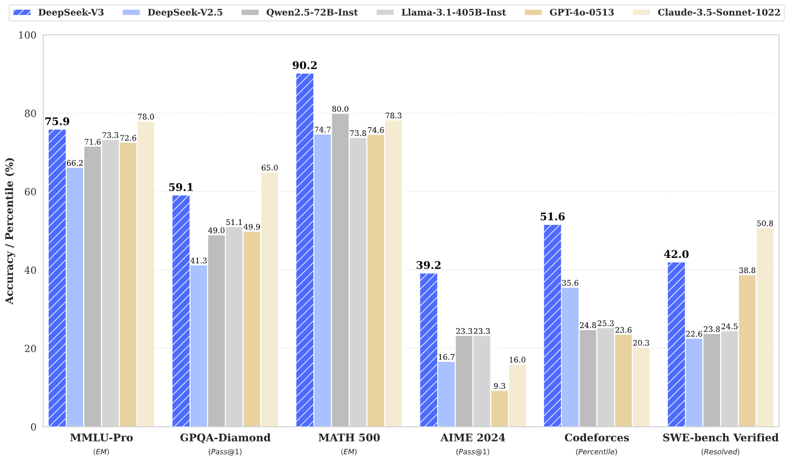
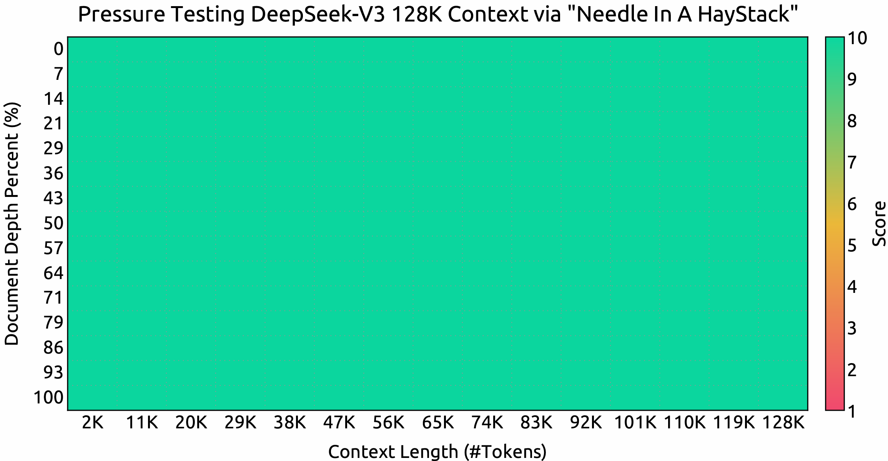

<!-- markdownlint-disable first-line-h1 -->
<!-- markdownlint-disable html -->
<!-- markdownlint-disable no-duplicate-header -->

<div align="center">
  
</div>
<hr>
<div align="center" style="line-height: 1;">
  <a href="https://www.deepseek.com/"></a>
  <a href="https://chat.deepseek.com/"></a>
  <a href="https://huggingface.co/deepseek-ai"></a>
  <br>
  <a href="https://discord.gg/Tc7c45Zzu5"></a>
  <a href="https://github.com/deepseek-ai/DeepSeek-V2/blob/main/figures/qr.jpeg?raw=true"></a>
  <a href="https://twitter.com/deepseek_ai"></a>
  <br>
  <a href="https://github.com/deepseek-ai/DeepSeek-V3/blob/main/LICENSE-CODE"></a>
  <a href="https://github.com/deepseek-ai/DeepSeek-V3/blob/main/LICENSE-MODEL"></a>
  <br>
  <a href="https://arxiv.org/pdf/2412.19437"><b>Enlace al Artículo</b>👁️</a>
</div>

## Tabla de Contenidos

1. [Introducción](#1-introducción)
2. [Resumen del Modelo](#2-resumen-del-modelo)
3. [Descargas del Modelo](#3-descargas-del-modelo)
4. [Resultados de Evaluación](#4-resultados-de-evaluación)
5. [Sitio Web de Chat y Plataforma API](#5-sitio-web-de-chat-y-plataforma-api)
6. [Cómo Ejecutar Localmente](#6-cómo-ejecutar-localmente)
7. [Licencia](#7-licencia)
8. [Citación](#8-citación)
9. [Contacto](#9-contacto)


## 1. Introducción

Presentamos DeepSeek-V3, un potente modelo de lenguaje Mixture-of-Experts (MoE) con 671B parámetros totales y 37B activados para cada token. 
Para lograr una inferencia eficiente y un entrenamiento rentable, DeepSeek-V3 adopta arquitecturas de Multi-head Latent Attention (MLA) y DeepSeekMoE, que fueron exhaustivamente validadas en DeepSeek-V2. 
Además, DeepSeek-V3 es pionero en una estrategia sin pérdida auxiliar para el balanceo de carga y establece un objetivo de entrenamiento de predicción de múltiples tokens para un rendimiento más fuerte. 
Pre-entrenamos DeepSeek-V3 en 14.8 billones de tokens diversos y de alta calidad, seguido de etapas de Fine-Tuning Supervisado y Aprendizaje por Refuerzo para aprovechar completamente sus capacidades. 
Evaluaciones exhaustivas revelan que DeepSeek-V3 supera a otros modelos de código abierto y logra un rendimiento comparable a los modelos de código cerrado líderes.
A pesar de su excelente rendimiento, DeepSeek-V3 requiere solo 2.788M horas de GPU H800 para su entrenamiento completo.
Además, su proceso de entrenamiento es notablemente estable. 
Durante todo el proceso de entrenamiento, no experimentamos picos de pérdida irrecuperables ni realizamos retrocesos. 
<p align="center">
  
</p>

## 2. Resumen del Modelo

---

**Arquitectura: Estrategia Innovadora de Balanceo de Carga y Objetivo de Entrenamiento**

- Sobre la arquitectura eficiente de DeepSeek-V2, somos pioneros en una estrategia sin pérdida auxiliar para el balanceo de carga, que minimiza la degradación del rendimiento que surge al fomentar el balanceo de carga.
- Investigamos un objetivo de Predicción de Múltiples Tokens (MTP) y demostramos que es beneficioso para el rendimiento del modelo. 
    También se puede usar para la decodificación especulativa para la aceleración de la inferencia. 

---

**Pre-Entrenamiento: Hacia la Máxima Eficiencia de Entrenamiento**

- Diseñamos un marco de entrenamiento de precisión mixta FP8 y, por primera vez, validamos la viabilidad y efectividad del entrenamiento FP8 en un modelo de escala extremadamente grande.  
- A través del co-diseño de algoritmos, marcos y hardware, superamos el cuello de botella de comunicación en el entrenamiento MoE entre nodos, logrando casi una superposición completa de computación y comunicación.  
  Esto mejora significativamente nuestra eficiencia de entrenamiento y reduce los costos de entrenamiento, permitiéndonos escalar aún más el tamaño del modelo sin costos adicionales.  
- A un costo económico de solo 2.664M horas de GPU H800, completamos el pre-entrenamiento de DeepSeek-V3 en 14.8T tokens, produciendo el modelo base de código abierto más fuerte actualmente. Las etapas de entrenamiento posteriores al pre-entrenamiento requieren solo 0.1M horas de GPU.

---

**Post-Entrenamiento: Destilación de Conocimiento de DeepSeek-R1**

-   Introducimos una metodología innovadora para destilar capacidades de razonamiento del modelo de larga Cadena de Pensamiento (CoT), específicamente de uno de los modelos de la serie DeepSeek R1, en LLMs estándar, particularmente DeepSeek-V3. Nuestro pipeline incorpora elegantemente los patrones de verificación y reflexión de R1 en DeepSeek-V3 y mejora notablemente su rendimiento de razonamiento. Mientras tanto, también mantenemos un control sobre el estilo y la longitud de salida de DeepSeek-V3.

---


## 3. Descargas del Modelo

<div align="center">

| **Modelo** | **#Parámetros Totales** | **#Parámetros Activados** | **Longitud del Contexto** | **Descargar** |
| :------------: | :------------: | :------------: | :------------: | :------------: |
| DeepSeek-V3-Base | 671B | 37B | 128K   | [🤗 Hugging Face](https://huggingface.co/deepseek-ai/DeepSeek-V3-Base)   |
| DeepSeek-V3   | 671B | 37B |  128K   | [🤗 Hugging Face](https://huggingface.co/deepseek-ai/DeepSeek-V3)   |

</div>

> [!NOTE]
> El tamaño total de los modelos DeepSeek-V3 en Hugging Face es de 685B, que incluye 671B de los pesos del Modelo Principal y 14B de los pesos del Módulo de Predicción de Múltiples Tokens (MTP).

Para asegurar un rendimiento óptimo y flexibilidad, nos hemos asociado con comunidades de código abierto y proveedores de hardware para proporcionar múltiples formas de ejecutar el modelo localmente. Para una guía paso a paso, consulte la Sección 6: [Cómo Ejecutar Localmente](#6-cómo-ejecutar-localmente).

Para los desarrolladores que buscan profundizar, recomendamos explorar [README_WEIGHTS.md](./README_WEIGHTS.md) para obtener detalles sobre los pesos del Modelo Principal y los Módulos de Predicción de Múltiples Tokens (MTP). Tenga en cuenta que el soporte para MTP está actualmente en desarrollo activo dentro de la comunidad, y agradecemos sus contribuciones y comentarios.

## 4. Resultados de Evaluación
### Modelo Base
#### Benchmarks Estándar

<div align="center">


|  | Benchmark (Métrica) | # Disparos | DeepSeek-V2 | Qwen2.5 72B | LLaMA3.1 405B | DeepSeek-V3 |
|---|-------------------|----------|--------|-------------|---------------|---------|
| | Arquitectura | - | MoE | Denso | Denso | MoE |
| | # Parámetros Activados | - | 21B | 72B | 405B | 37B |
| | # Parámetros Totales | - | 236B | 72B | 405B | 671B |
| Inglés | Pile-test (BPB) | - | 0.606 | 0.638 | **0.542** | 0.548 |
| | BBH (EM) | 3-disparos | 78.8 | 79.8 | 82.9 | **87.5** |
| | MMLU (Acc.) | 5-disparos | 78.4 | 85.0 | 84.4 | **87.1** |
| | MMLU-Redux (Acc.) | 5-disparos | 75.6 | 83.2 | 81.3 | **86.2** |
| | MMLU-Pro (Acc.) | 5-disparos | 51.4 | 58.3 | 52.8 | **64.4** |
| | DROP (F1) | 3-disparos | 80.4 | 80.6 | 86.0 | **89.0** |
| | ARC-Easy (Acc.) | 25-disparos | 97.6 | 98.4 | 98.4 | **98.9** |
| | ARC-Challenge (Acc.) | 25-disparos | 92.2 | 94.5 | **95.3** | **95.3** |
| | HellaSwag (Acc.) | 10-disparos | 87.1 | 84.8 | **89.2** | 88.9 |
| | PIQA (Acc.) | 0-disparos | 83.9 | 82.6 | **85.9** | 84.7 |
| | WinoGrande (Acc.) | 5-disparos | **86.3** | 82.3 | 85.2 | 84.9 |
| | RACE-Middle (Acc.) | 5-disparos | 73.1 | 68.1 | **74.2** | 67.1 |
| | RACE-High (Acc.) | 5-disparos | 52.6 | 50.3 | **56.8** | 51.3 |
| | TriviaQA (EM) | 5-disparos | 80.0 | 71.9 | 82.7 | **82.9** |
| | NaturalQuestions (EM) | 5-disparos | 38.6 | 33.2 | **41.5** | 40.0 |
| | AGIEval (Acc.) | 0-disparos | 57.5 | 75.8 | 60.6 | **79.6** |
| Código | HumanEval (Pass@1) | 0-disparos | 43.3 | 53.0 | 54.9 | **65.2** |
| | MBPP (Pass@1) | 3-disparos | 65.0 | 72.6 | 68.4 | **75.4** |
| | LiveCodeBench-Base (Pass@1) | 3-disparos | 11.6 | 12.9 | 15.5 | **19.4** |
| | CRUXEval-I (Acc.) | 2-disparos | 52.5 | 59.1 | 58.5 | **67.3** |
| | CRUXEval-O (Acc.) | 2-disparos | 49.8 | 59.9 | 59.9 | **69.8** |
| Matemáticas | GSM8K (EM) | 8-disparos | 81.6 | 88.3 | 83.5 | **89.3** |
| | MATH (EM) | 4-disparos | 43.4 | 54.4 | 49.0 | **61.6** |
| | MGSM (EM) | 8-disparos | 63.6 | 76.2 | 69.9 | **79.8** |
| | CMath (EM) | 3-disparos | 78.7 | 84.5 | 77.3 | **90.7** |
| Chino | CLUEWSC (EM) | 5-disparos | 82.0 | 82.5 | **83.0** | 82.7 |
| | C-Eval (Acc.) | 5-disparos | 81.4 | 89.2 | 72.5 | **90.1** |
| | CMMLU (Acc.) | 5-disparos | 84.0 | **89.5** | 73.7 | 88.8 |
| | CMRC (EM) | 1-disparo | **77.4** | 75.8 | 76.0 | 76.3 |
| | C3 (Acc.) | 0-disparos | 77.4 | 76.7 | **79.7** | 78.6 |
| | CCPM (Acc.) | 0-disparos | **93.0** | 88.5 | 78.6 | 92.0 |
| Multilingüe | MMMLU-no-Inglés (Acc.) | 5-disparos | 64.0 | 74.8 | 73.8 | **79.4** |

</div>

> [!NOTE]
> Los mejores resultados se muestran en negrita. Las puntuaciones con una diferencia que no exceda 0.3 se consideran al mismo nivel. DeepSeek-V3 logra el mejor rendimiento en la mayoría de los benchmarks, especialmente en tareas de matemáticas y código.
> Para más detalles de evaluación, por favor consulte nuestro artículo. 

#### Ventana de Contexto
<p align="center">
  
</p>

Resultados de evaluación en las pruebas ``Needle In A Haystack`` (NIAH). DeepSeek-V3 se desempeña bien en todas las longitudes de ventana de contexto hasta **128K**. 

### Modelo de Chat
#### Benchmarks Estándar (Modelos mayores de 67B)
<div align="center">

| | **Benchmark (Métrica)** | **DeepSeek V2-0506** | **DeepSeek V2.5-0905** | **Qwen2.5 72B-Inst.** | **Llama3.1 405B-Inst.** | **Claude-3.5-Sonnet-1022** | **GPT-4o 0513** | **DeepSeek V3** |
|---|---------------------|---------------------|----------------------|---------------------|----------------------|---------------------------|----------------|----------------|
| | Arquitectura | MoE | MoE | Denso | Denso | - | - | MoE |
| | # Parámetros Activados | 21B | 21B | 72B | 405B | - | - | 37B |
| | # Parámetros Totales | 236B | 236B | 72B | 405B | - | - | 671B |
| Inglés | MMLU (EM) | 78.2 | 80.6 | 85.3 | **88.6** | **88.3** | 87.2 | **88.5** |
| | MMLU-Redux (EM) | 77.9 | 80.3 | 85.6 | 86.2 | **88.9** | 88.0 | **89.1** |
| | MMLU-Pro (EM) | 58.5 | 66.2 | 71.6 | 73.3 | **78.0** | 72.6 | 75.9 |
| | DROP (3-disparos F1) | 83.0 | 87.8 | 76.7 | 88.7 | 88.3 | 83.7 | **91.6** |
| | IF-Eval (Prompt Strict) | 57.7 | 80.6 | 84.1 | 86.0 | **86.5** | 84.3 | 86.1 |
| | GPQA-Diamond (Pass@1) | 35.3 | 41.3 | 49.0 | 51.1 | **65.0** | 49.9 | 59.1 |
| | SimpleQA (Correcto) | 9.0 | 10.2 | 9.1 | 17.1 | 28.4 | **38.2** | 24.9 |
| | FRAMES (Acc.) | 66.9 | 65.4 | 69.8 | 70.0 | 72.5 | **80.5** | 73.3 |
| | LongBench v2 (Acc.) | 31.6 | 35.4 | 39.4 | 36.1 | 41.0 | 48.1 | **48.7** |
| Código | HumanEval-Mul (Pass@1) | 69.3 | 77.4 | 77.3 | 77.2 | 81.7 | 80.5 | **82.6** |
| | LiveCodeBench (Pass@1-COT) | 18.8 | 29.2 | 31.1 | 28.4 | 36.3 | 33.4 | **40.5** |
| | LiveCodeBench (Pass@1) | 20.3 | 28.4 | 28.7 | 30.1 | 32.8 | 34.2 | **37.6** |
| | Codeforces (Percentil) | 17.5 | 35.6 | 24.8 | 25.3 | 20.3 | 23.6 | **51.6** |
| | SWE Verified (Resuelto) | - | 22.6 | 23.8 | 24.5 | **50.8** | 38.8 | 42.0 |
| | Aider-Edit (Acc.) | 60.3 | 71.6 | 65.4 | 63.9 | **84.2** | 72.9 | 79.7 |
| | Aider-Polyglot (Acc.) | - | 18.2 | 7.6 | 5.8 | 45.3 | 16.0 | **49.6** |
| Matemáticas | AIME 2024 (Pass@1) | 4.6 | 16.7 | 23.3 | 23.3 | 16.0 | 9.3 | **39.2** |
| | MATH-500 (EM) | 56.3 | 74.7 | 80.0 | 73.8 | 78.3 | 74.6 | **90.2** |
| | CNMO 2024 (Pass@1) | 2.8 | 10.8 | 15.9 | 6.8 | 13.1 | 10.8 | **43.2** |
| Chino | CLUEWSC (EM) | 89.9 | 90.4 | **91.4** | 84.7 | 85.4 | 87.9 | 90.9 |
| | C-Eval (EM) | 78.6 | 79.5 | 86.1 | 61.5 | 76.7 | 76.0 | **86.5** |
| | C-SimpleQA (Correcto) | 48.5 | 54.1 | 48.4 | 50.4 | 51.3 | 59.3 | **64.8** |

</div>

> [!NOTE]
> Todos los modelos se evalúan en una configuración que limita la longitud de salida a 8K. Los benchmarks que contienen menos de 1000 muestras se prueban varias veces utilizando configuraciones de temperatura variables para derivar resultados finales robustos. DeepSeek-V3 se destaca como el modelo de código abierto con mejor rendimiento, y también exhibe un rendimiento competitivo frente a los modelos de código cerrado de vanguardia.


#### Evaluación de Generación Abierta

<div align="center">


| Modelo | Arena-Difícil | AlpacaEval 2.0 |
|-------|------------|----------------|
| DeepSeek-V2.5-0905 | 76.2 | 50.5 |
| Qwen2.5-72B-Instruct | 81.2 | 49.1 |
| LLaMA-3.1 405B | 69.3 | 40.5 |
| GPT-4o-0513 | 80.4 | 51.1 |
| Claude-Sonnet-3.5-1022 | 85.2 | 52.0 |
| DeepSeek-V3 | **85.5** | **70.0** |

</div>

> [!NOTE]
> Evaluaciones de conversación abierta en inglés. Para AlpacaEval 2.0, utilizamos la tasa de victorias controlada por longitud como métrica.


## 5. Sitio Web de Chat y Plataforma API
Puedes chatear con DeepSeek-V3 en el sitio web oficial de DeepSeek: [chat.deepseek.com](https://chat.deepseek.com/sign_in)

También proporcionamos API compatible con OpenAI en la Plataforma DeepSeek: [platform.deepseek.com](https://platform.deepseek.com/)

## 6. Cómo Ejecutar Localmente

DeepSeek-V3 se puede desplegar localmente utilizando el siguiente hardware y software de la comunidad de código abierto:

1. **DeepSeek-Infer Demo**: Proporcionamos una demostración simple y ligera para la inferencia en FP8 y BF16.
2. **SGLang**: Soporte completo para el modelo DeepSeek-V3 en modos de inferencia BF16 y FP8, con Predicción de Múltiples Tokens [próximamente](https://github.com/sgl-project/sglang/issues/2591).
3. **LMDeploy**: Permite una inferencia eficiente en FP8 y BF16 para despliegue local y en la nube.
4. **TensorRT-LLM**: Actualmente soporta inferencia en BF16 y cuantización INT4/8, con soporte para FP8 próximamente.
5. **vLLM**: Soporte para el modelo DeepSeek-V3 en modos FP8 y BF16 para paralelismo de tensores y paralelismo de tuberías.
6. **AMD GPU**: Permite ejecutar el modelo DeepSeek-V3 en GPUs AMD a través de SGLang en modos BF16 y FP8.
7. **Huawei Ascend NPU**: Soporte para ejecutar DeepSeek-V3 en dispositivos Huawei Ascend.

Dado que el entrenamiento en FP8 se adopta de forma nativa en nuestro marco, solo proporcionamos pesos en FP8. Si necesita pesos en BF16 para experimentación, puede usar el script de conversión proporcionado para realizar la transformación.

Aquí hay un ejemplo de conversión de pesos FP8 a BF16:

```shell
cd inference
python fp8_cast_bf16.py --input-fp8-hf-path /path/to/fp8_weights --output-bf16-hf-path /path/to/bf16_weights
```

> [!NOTE]
> Hugging Face's Transformers aún no ha sido soportado directamente.

### 6.1 Inferencia con DeepSeek-Infer Demo (solo ejemplo)

#### Requisitos del Sistema

> [!NOTE] 
> Linux con Python 3.10 solamente. Mac y Windows no son soportados.

Dependencias:
```pip-requirements
torch==2.4.1
triton==3.0.0
transformers==4.46.3
safetensors==0.4.5
```
#### Preparación de Pesos del Modelo y Código de Demostración

Primero, clona nuestro repositorio de GitHub de DeepSeek-V3:

```shell
git clone https://github.com/deepseek-ai/DeepSeek-V3.git
```

Navega a la carpeta `inference` e instala las dependencias listadas en `requirements.txt`. La forma más fácil es usar un gestor de paquetes como `conda` o `uv` para crear un nuevo entorno virtual e instalar las dependencias.

```shell
cd DeepSeek-V3/inference
pip install -r requirements.txt
```

Descarga los pesos del modelo desde Hugging Face y colócalos en la carpeta `/path/to/DeepSeek-V3`.

#### Conversión de Pesos del Modelo

Convierte los pesos del modelo de Hugging Face a un formato específico:

```shell
python convert.py --hf-ckpt-path /path/to/DeepSeek-V3 --save-path /path/to/DeepSeek-V3-Demo --n-experts 256 --model-parallel 16
```

#### Ejecutar

Luego puedes chatear con DeepSeek-V3:

```shell
torchrun --nnodes 2 --nproc-per-node 8 --node-rank $RANK --master-addr $ADDR generate.py --ckpt-path /path/to/DeepSeek-V3-Demo --config configs/config_671B.json --interactive --temperature 0.7 --max-new-tokens 200
```

O inferencia por lotes en un archivo dado:

```shell
torchrun --nnodes 2 --nproc-per-node 8 --node-rank $RANK --master-addr $ADDR generate.py --ckpt-path /path/to/DeepSeek-V3-Demo --config configs/config_671B.json --input-file $FILE
```

### 6.2 Inferencia con SGLang (recomendado)

[SGLang](https://github.com/sgl-project/sglang) actualmente soporta [optimizaciones MLA](https://lmsys.org/blog/2024-09-04-sglang-v0-3/#deepseek-multi-head-latent-attention-mla-throughput-optimizations), [Atención DP](https://lmsys.org/blog/2024-12-04-sglang-v0-4/#data-parallelism-attention-for-deepseek-models), FP8 (W8A8), FP8 KV Cache y Torch Compile, ofreciendo el rendimiento de latencia y rendimiento más avanzado entre los marcos de código abierto.

Notablemente, [SGLang v0.4.1](https://github.com/sgl-project/sglang/releases/tag/v0.4.1) soporta completamente la ejecución de DeepSeek-V3 en **GPUs NVIDIA y AMD**, lo que lo convierte en una solución altamente versátil y robusta.

SGLang también soporta [paralelismo de tensores multinodo](https://github.com/sgl-project/sglang/tree/main/benchmark/deepseek_v3#example-serving-with-2-h208), permitiéndote ejecutar este modelo en múltiples máquinas conectadas por redes.

La Predicción de Múltiples Tokens (MTP) está en desarrollo, y el progreso se puede seguir en el [plan de optimización](https://github.com/sgl-project/sglang/issues/2591).

Aquí están las instrucciones de lanzamiento del equipo de SGLang: https://github.com/sgl-project/sglang/tree/main/benchmark/deepseek_v3

### 6.3 Inferencia con LMDeploy (recomendado)
[LMDeploy](https://github.com/InternLM/lmdeploy), un marco de inferencia y despliegue flexible y de alto rendimiento diseñado para modelos de lenguaje grande, ahora soporta DeepSeek-V3. Ofrece capacidades tanto de procesamiento de pipeline offline como de despliegue online, integrándose perfectamente con flujos de trabajo basados en PyTorch.

Para instrucciones detalladas paso a paso sobre cómo ejecutar DeepSeek-V3 con LMDeploy, por favor consulte aquí: https://github.com/InternLM/lmdeploy/issues/2960


### 6.4 Inferencia con TRT-LLM (recomendado)

[TensorRT-LLM](https://github.com/NVIDIA/TensorRT-LLM) ahora soporta el modelo DeepSeek-V3, ofreciendo opciones de precisión como BF16 y peso solo INT4/INT8. El soporte para FP8 está actualmente en progreso y se lanzará pronto. Puedes acceder a la rama personalizada de TRTLLM específicamente para el soporte de DeepSeek-V3 a través del siguiente enlace para experimentar las nuevas características directamente: https://github.com/NVIDIA/TensorRT-LLM/tree/deepseek/examples/deepseek_v3. 


### 6.5 Inferencia con vLLM (recomendado)

[vLLM](https://github.com/vllm-project/vllm) v0.6.6 soporta la inferencia de DeepSeek-V3 en modos FP8 y BF16 en GPUs NVIDIA y AMD. Además de las técnicas estándar, vLLM ofrece _paralelismo de tuberías_ permitiéndote ejecutar este modelo en múltiples máquinas conectadas por redes. Para una guía detallada, por favor consulta las [instrucciones de vLLM](https://docs.vllm.ai/en/latest/serving/distributed_serving.html). Siéntete libre de seguir [el plan de mejora](https://github.com/vllm-project/vllm/issues/11539) también.

### 6.6 Funcionalidad de Inferencia Recomendada con GPUs AMD

En colaboración con el equipo de AMD, hemos logrado soporte Day-One para GPUs AMD utilizando SGLang, con compatibilidad total para precisión FP8 y BF16. Para una guía detallada, por favor consulta las [instrucciones de SGLang](#63-inferencia-con-lmdeploy-recomendado).

### 6.7 Funcionalidad de Inferencia Recomendada con NPUs Huawei Ascend
El marco [MindIE](https://www.hiascend.com/en/software/mindie) de la comunidad Huawei Ascend ha adaptado con éxito la versión BF16 de DeepSeek-V3. Para una guía paso a paso sobre NPUs Ascend, por favor sigue las [instrucciones aquí](https://modelers.cn/models/MindIE/deepseekv3).


## 7. Licencia
Este repositorio de código está licenciado bajo [la Licencia MIT](LICENSE-CODE). El uso de los modelos DeepSeek-V3 Base/Chat está sujeto a [la Licencia del Modelo](LICENSE-MODEL). La serie DeepSeek-V3 (incluyendo Base y Chat) soporta uso comercial.

## 8. Citación
```
@misc{deepseekai2024deepseekv3technicalreport,
      title={DeepSeek-V3 Technical Report}, 
      author={DeepSeek-AI},
      year={2024},
      eprint={2412.19437},
      archivePrefix={arXiv},
      primaryClass={cs.CL},
      url={https://arxiv.org/abs/2412.19437}, 
}
```

## 9. Contacto
Si tienes alguna pregunta, por favor levanta un issue o contáctanos en [service@deepseek.com](service@deepseek.com).
